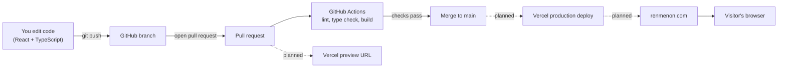

# renmenon.com

Personal website for Ren Menon, built to learn **TypeScript**, **React**, and **deployment with Vercel**.

**In short:** the code lives on GitHub, GitHub Actions checks every change, and Vercel publishes the site automatically.

## Contents

- [Architecture: how a change reaches the live site](#architecture-how-a-change-reaches-the-live-site)
- [Run the site on your computer](#run-the-site-on-your-computer)
- [How the site works](#how-the-site-works)
- [Project files and what each one does](#project-files-and-what-each-one-does)
- [Automated checks run on every pull request](#automated-checks-run-on-every-pull-request)
- [Deployment with Vercel (planned)](#deployment-with-vercel-planned)
- [Learning path](#learning-path)

## Architecture: how a change reaches the live site

The diagram shows the full path from editing code to a visitor seeing it. Solid boxes are built today. The Vercel and domain steps are planned.



**Legend:** solid arrows are working now. Dotted arrows are planned.

## Run the site on your computer

You need **Node.js 22 or newer**. Check with `node --version`.

```bash
npm install     # download the libraries listed in package.json (first time only)
npm run dev     # start the development server
```

Open the address printed in the terminal, usually `http://localhost:5173`. Edits to files in `src/` appear in the browser immediately.

| Command | What it does |
|---|---|
| `npm run dev` | Starts the development server with instant reload |
| `npm run lint` | Finds likely mistakes in the code |
| `npm run typecheck` | Checks that the TypeScript types are consistent |
| `npm run build` | Produces the final site files in the `dist/` folder |
| `npm run preview` | Serves the `dist/` folder locally, to test the final build |

## How the site works

The site is a **single-page application**. The browser downloads one HTML file and one JavaScript file, and React draws the page inside the browser.

**Step by step:**

1. The browser opens `index.html`. It contains an empty `<div id="root">` and a script tag.
2. The script tag loads `src/main.tsx`.
3. `main.tsx` tells React to draw the `App` component inside the `root` div.
4. `App` (in `src/App.tsx`) returns JSX, which looks like HTML but is TypeScript code.
5. **Tailwind CSS** styles the page. Class names such as `text-3xl` and `mt-4` in the JSX map to ready-made styles.

### Key terms

| Term | Meaning |
|---|---|
| **React** | A library that builds web pages from small reusable pieces called components |
| **Component** | A function that returns what part of the page should look like |
| **JSX** | HTML-like syntax written inside TypeScript files (`.tsx`) |
| **TypeScript** | JavaScript with types, so mistakes are caught before the site runs |
| **Vite** | The tool that runs the development server and bundles the site for production |
| **Tailwind CSS** | A styling system where you add small class names directly to elements |

## Project files and what each one does

```text
renmenon.com/
├── .github/workflows/ci.yml   Automated checks that run on GitHub
├── public/                    Files served as they are (for example, the favicon)
├── src/
│   ├── main.tsx               Entry point: starts React
│   ├── App.tsx                The home page component
│   └── index.css              Imports Tailwind and sets base styles
├── index.html                 The single HTML page the browser loads
├── vite.config.ts             Vite settings (React and Tailwind plugins)
├── tsconfig*.json             TypeScript settings
├── .oxlintrc.json             Lint rules
└── package.json               Libraries and the npm commands above
```

**Where to edit:** change the text and links in `src/App.tsx`. Add new pages as new components in `src/`.

## Automated checks run on every pull request

The file `.github/workflows/ci.yml` tells GitHub Actions to run these steps on every pull request and every push to `main`:

1. `npm ci` installs the exact library versions in `package-lock.json`.
2. `npm run lint` looks for likely mistakes.
3. `npm run typecheck` verifies the TypeScript types.
4. `npm run build` confirms the site builds.

**If a step fails,** the pull request shows a red mark. Run the same command on your computer to see the error.

## Deployment with Vercel (planned)

Vercel is a hosting service that is free for personal projects. Once connected to this repository:

- **Every pull request** gets its own preview URL.
- **Every merge to `main`** updates the live site.
- **Settings:** Vercel detects Vite automatically (build command `npm run build`, output folder `dist`).

**Setup steps:**

1. Sign up at vercel.com with your GitHub account.
2. Choose **Add New → Project** and import this repository.
3. Accept the detected settings and click **Deploy**.
4. Under **Project Settings → Domains**, add `renmenon.com` and set the DNS records Vercel shows at your domain registrar.

## Learning path

Suggested order of small projects on this site:

1. Change the text in `App.tsx` and watch the browser update.
2. Split the page into components (`Header`, `Links`) in new files under `src/`.
3. Pass data to a component with **props**, and type those props in TypeScript.
4. Store the list of links as typed data and render it with `.map()`.
5. Add a second page with a router, then deploy to Vercel.
